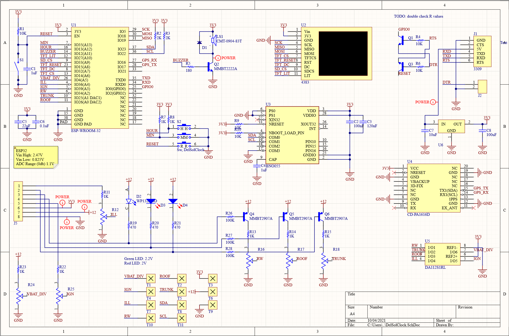
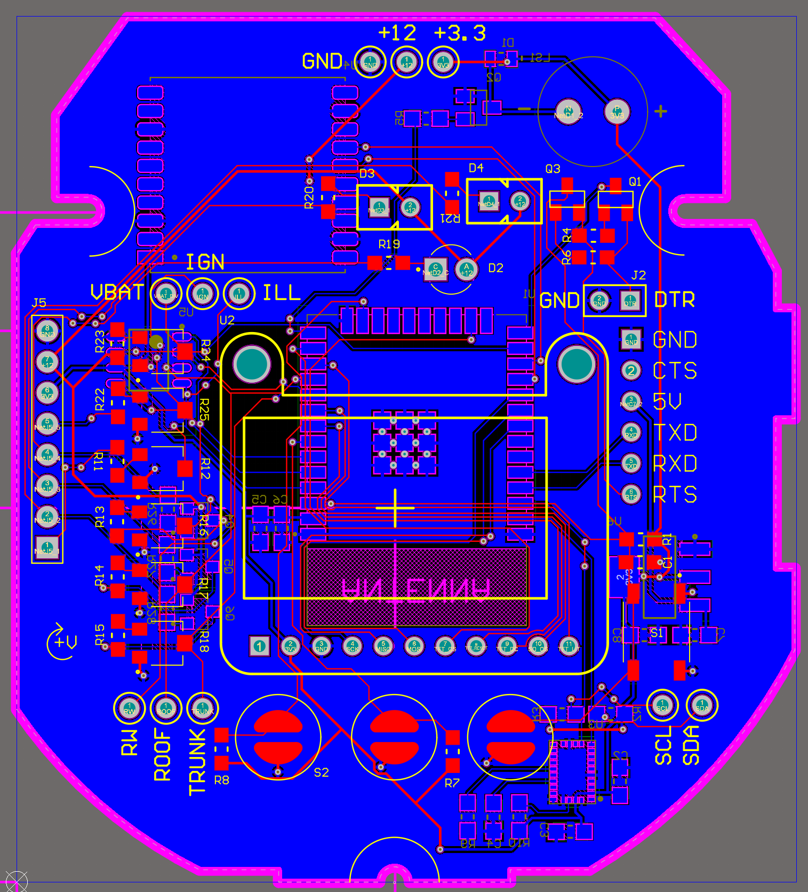
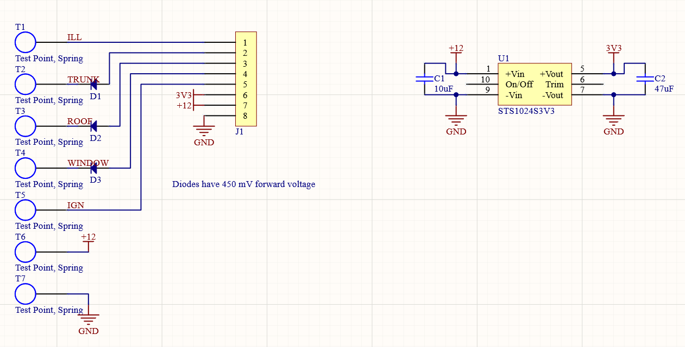
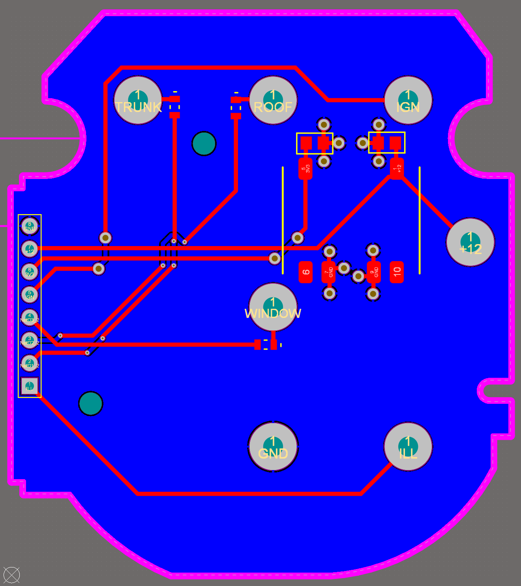

# Del Sol Clock Hardware

The Del Sol's clock contains 2 PCBs, one which has connections to the screw terminals on the back, and the other with everything else.

The folders DelSolClock and DelSolClock_Rear contain the altium projects for each, respectively.

The gerber files for each are stored in DelSolClock.zip and DelSolClock_Rear.zip, respectively.

## Front PCB Schematic

## Front PCB Layout

## Rear PCB Schematic

## Rear PCB Layout

