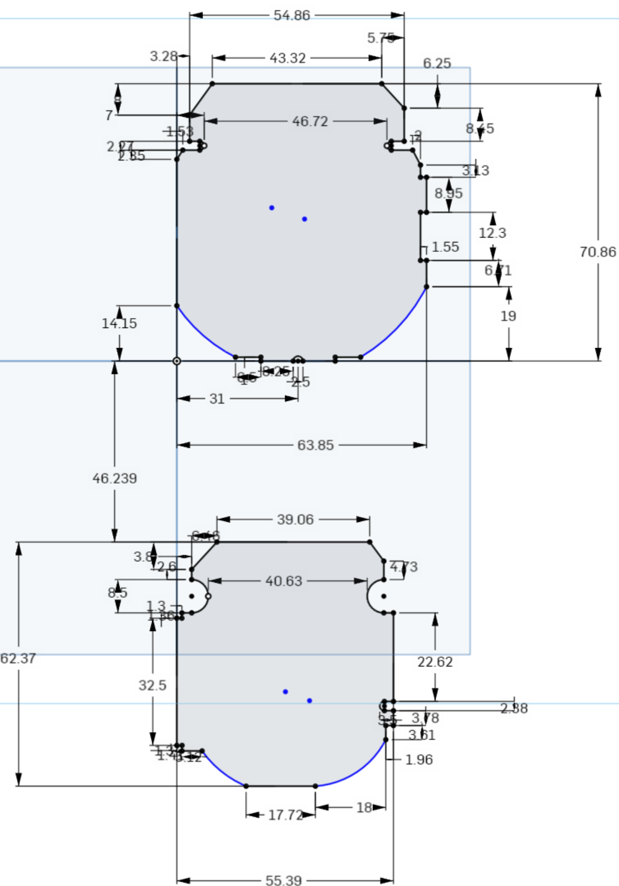

# Del Sol Clock Hardware

The Del Sol's clock contains 2 PCBs, one which has connections to the screw terminals on the back, and the other with everything else.

The folders DelSolClock and DelSolClock_Rear contain the altium projects for each, respectively.

The gerber files for each are stored in DelSolClock.zip and DelSolClock_Rear.zip, respectively.

## PCB CAD

The PCBs need to fit inside of the clock enclosure, and a lot of mechanical features need to line up with the PCB. To do so, I created CAD models of the original clocks PCBs.

The cad models are available on onshape.com here:

https://cad.onshape.com/documents/c03c46c06b1644a01c41d4cb/w/f61ed74aacd91dbb499e79e7/e/812b9ffb5ed769614eaed996?renderMode=0&uiState=615be53a9ee53341f9e98e27

## Front PCB Schematic

## Front PCB Layout

## Rear PCB Schematic

## Rear PCB Layout

