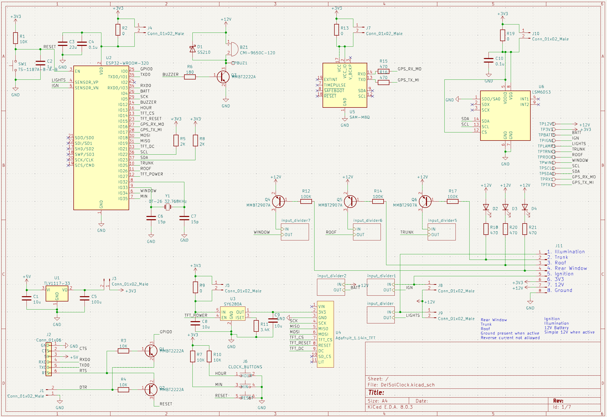
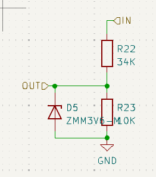
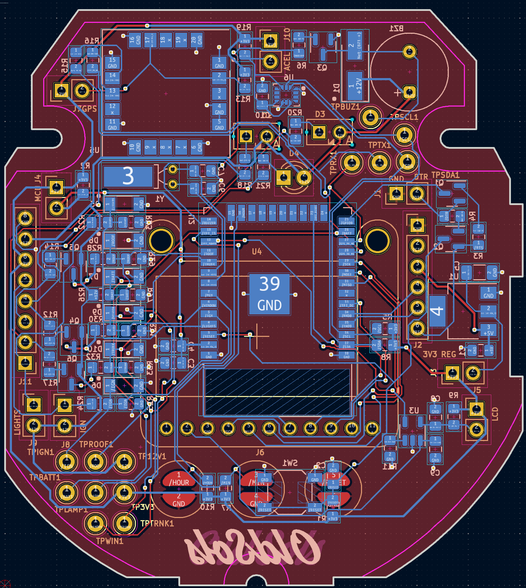
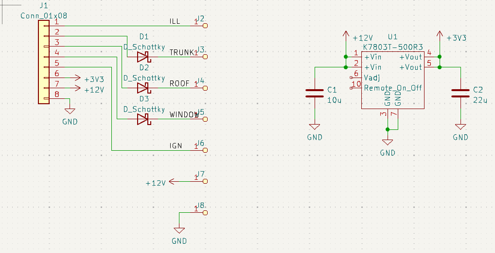
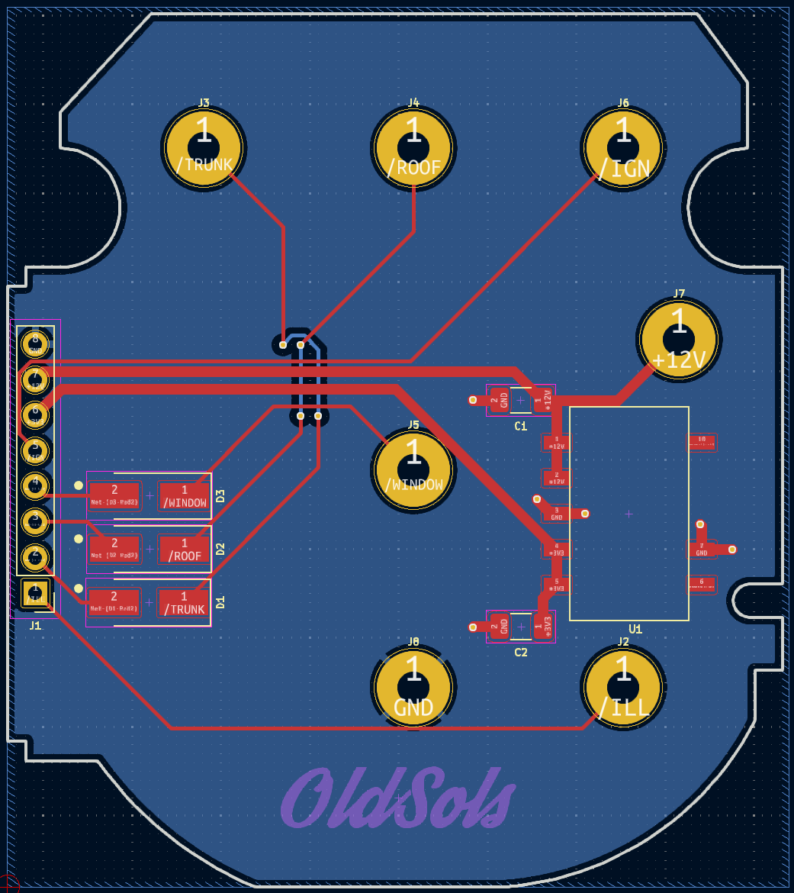

# Hardware

The Del Sol Clock PCBs are designed to be direct replacements for the stock clock PCBs found in the original dash clock.

There are two PCBs in the clock housing. The front PCB, which contains pretty everything, and a rear PCB, which is largely responsible for the electrical connections to the car.

The two PCBs are designed with KiCad. The front PCB is located in the `./DelSolClock` directory, and the rear PCB is located in `./DelSolClock-Rear` directory.

## Front PCB

Schematic:

Divider Circuit:

This divider circuit is used to shift the 12V signal down to 3.3V without engaging over voltage protection. It uses a ~3.6 volt Zener diode to clamp the voltage, which is preferred over regular rail clamps to prevent damage if the supply voltage is not present when a 12V input is applied.

PCB:

## Rear PCB

The rear PCB contains a 12V to 3.3V buck converter module, to provide power to the front PCB, and routes all the car IO signals to the front PCB.

The front PCB is connected to the read PCB with a short 8 pin ribbon cable.

The rear PCB also contains diodes for the Trunk, Roof, and Window signals, to prevent backfeeding into the car's electrical system.

The following signals are provided by the car:

- 12V Power (battery, always hot)
- Ground
- Ignition (IGN)
- Rear Window
- Roof removed
- Trunk Open
- Dash Illumination (ILL)

Rear window, roof removed, and trunk open are open drain signals, which either float or get connected to ground when active. The stock dash clock contained indicator LEDs connected to these signals.

Ignition is also an active high signal, which is only high when the ignition is on. I think it floats when not active.

Dash illumination is connected to the dash's lights, which are dimmable, but only on when the headlights are on. This controlled the brightness of the original dash clock's display. When the headlights are off, the stock clock would run at max brightness.

Schematic:

PCB:

